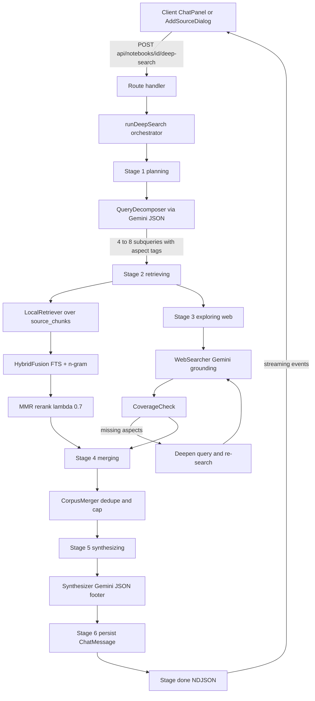

# Deep Search over Sources — Technical Design Specification

**Feature:** البحث العميق في المصادر (Deep Search over Sources)
**App:** MaghzAI NotebookLM (بحّاثة)
**Status:** Design / Architecture — ready for Code-mode implementation
**Author:** Architect mode
**Date:** 2026-08-02

---

## 1. Executive Summary

This spec designs a multi-stage, streaming "deep research" pipeline that fuses **local notebook sources**
(PostgreSQL FTS + client-side n-gram lexical scoring, optionally lightweight Gemini embeddings) with
**live web grounding** (Gemini `google_search` tool, behind a swappable `WebSearcher` interface) to produce
a comprehensive, multi-aspect, fully-cited synthesis answer in Arabic.

The pipeline has six stages: `planning → retrieving → exploring → merging → synthesizing → done`, streamed
to the client as NDJSON progress events so the user sees the research happen in real time.



### Key decisions at a glance

| Decision | Choice | Rationale |
|---|---|---|
| Vector store | None — n-gram fusion + optional pluggable embeddings | No new deps, no schema migration for vectors, dual pg/sqlite portable |
| Web search provider | Gemini `google_search` grounding behind `WebSearcher` interface | Already used in codebase; Tavily/Brave/SerpAPI can be added later |
| Streaming | NDJSON stage events; answer as final chunk (Option A) | `callGemini` is non-streaming; low-risk; Option B (SSE token relay) designed as follow-up |
| Persistence | Save as `ChatMessage` with extended citations | Reuses existing chat UI, history, citations pills |
| Arabic morphology | LLM-driven query expansion (no stemming) | FTS `simple` config cannot stem Arabic; expansion compensates |
| Runtime | Node.js runtime (`force-dynamic`) | Route handlers already node; maxDuration needed |
| Auth | `requireAuth`-style user scoping via `notebook.userId` | Match existing routes; notebook ownership check |

---

## 2. Requirements Traceability

| # | Requirement | Where addressed |
|---|---|---|
| 1 | Multi-query decomposition (query planning) | §3 `queries.ts` |
| 2 | Hybrid retrieval over local sources | §4 `retriever.ts`, `rerank.ts`, `embedding.ts` |
| 3 | Recursive/iterative web exploration | §5 `web.ts`, `corpus.ts` |
| 4 | Multi-aspect synthesis | §6 `synthesizer.ts` |
| 5 | Streaming / progress UX | §7 `events.ts`, `deep-search-progress.tsx` |
| 6 | API route design | §8 `route.ts` |
| 7 | Module/file layout | §9 |
| 8 | Testing strategy | §10 |
| 9 | Risks & mitigations | §11 |

---

## 3. Multi-Query Decomposition (Query Planning)

### 3.1 Goal

Given a user question like `"ما هو الذكاء الاصطناعي؟"`, produce **4–8 diverse sub-queries**, each tagged with an
**aspect** covering a different dimension of the topic. These sub-queries drive both local retrieval and web
exploration, guaranteeing all angles are covered.

### 3.2 Aspect vocabulary

```ts
// src/lib/search/types.ts
export const ASPECTS = [
  "definition", "history", "types", "mechanism", "applications",
  "pros_cons", "statistics", "controversies", "recent_developments",
  "future_outlook", "comparisons", "expert_opinions",
] as const;
export type Aspect = (typeof ASPECTS)[number];

export type SubQuery = {
  id: string;              // `q1`..`qN`
  text: string;            // the actual search query (Arabic-first)
  aspect: Aspect;
  rationale: string;       // short Arabic justification
  expansions: string[];    // synonym / morphological variants (2-4 per sub-query)
  weight: number;          // 0..1 — importance for fusion weighting
};
```

### 3.3 Prompt (Arabic-first, structured JSON output)

System prompt:

```text
أنت خبير في هندسة الاستعلامات البحثية العميقة. مهمتك تحليل سؤال المستخدم وتفكيكه إلى
أسئلة فرعية متنوعة تغطي جميع جوانب الموضوع من زوايا متعددة.

القواعد:
1. قدّم من 4 إلى 8 أسئلة فرعية بحسب تعقيد الموضوع.
2. كل سؤال فرعي يجب أن يركز على جانب واحد محدد من الأبعاد التالية:
   definition التعريف والمفهوم، history التاريخ والتطور، types الأنواع والتصنيفات،
   mechanism آلية العمل، applications التطبيقات والاستخدامات، pros_cons المزايا والعيوب،
   statistics الإحصائيات والأرقام، controversies الخلافات والجدل،
   recent_developments آخر التطورات، future_outlook المستقبل والتوقعات،
   comparisons المقارنات، expert_opinions آراء الخبراء.
3. غطّ أبعاداً مختلفة ولا تكرر نفس البعد.
4. لكل سؤال فرعي أضف 2 إلى 4 صيغ مترادفة أو مشتقة (expansions) بلغة السؤال
   لتعويض عدم وجود تحليل صرفي (جذر/وزن) في محرك البحث، مثل:
   كتاب → كتب، الكتب، المؤلفات.
5. أضف وزناً (weight) بين 0 و1 يعبّر عن أهمية هذا البعد بالنسبة لسؤال المستخدم.
6. أعد الناتج بصيغة JSON صرفة بدون أي نص إضافي وبالشكل التالي:

{"subQueries":[{"text":"...","aspect":"definition","rationale":"...","expansions":["..."],"weight":0.9}]}
```

User prompt:

```text
سؤال المستخدم: {question}

لغة السؤال تحدد لغة الأسئلة الفرعية. إن كان السؤال عربياً فاكتب الأسئلة الفرعية بالعربية.
حلّل السؤال وفكّكه إلى أسئلة فرعية وفق التعليمات.
```

### 3.4 JSON parsing with fallback

```ts
// src/lib/search/queries.ts

export interface QueryDecomposer {
  decompose(question: string, signal?: AbortSignal): Promise<SubQuery[]>;
}

export async function parseSubQueries(raw: string): SubQuery[];          // strict JSON parse + schema validation
export function fallbackSubQueries(question: string): SubQuery[];       // local deterministic decomposition
export async function decomposeQuestion(question: string, signal?: AbortSignal): Promise<SubQuery[]>;
```

- `parseSubQueries` strips code fences, extracts the first JSON object, validates each field, enforces the
  `Aspect` enum, dedupes aspects, and clamps `weight` to [0.1, 1]. Filters out sub-queries whose text is < 3 chars.
- `fallbackSubQueries` builds 5 heuristic sub-queries by scanning the question for aspect keywords
  (e.g. "تاريخ" → `history`, "مزايا"/"عيوب" → `pros_cons`, "أنواع" → `types`) and completing the rest with
  generic templates (`ما هي التطبيقات العملية لـ {topic}؟`). Uses `topKeywords` from `src/lib/text/summarize.ts`
  to extract the topic when no keyword matches.
- `decomposeQuestion` calls the Gemini JSON client (§9.2) with temperature 0.6, `responseMimeType: "application/json"`,
  and falls back to `fallbackSubQueries` on null/parse failure or missing API key.

### 3.5 Iterative refinement (query expansion)

Expansion happens at two levels, both **LLM-driven** (never relying on FTS stemming):

1. **Static expansions** per sub-query from the decomposition prompt (§3.3) — synonyms and morphological variants
   are folded into retrieval by OR-ing them into the n-gram lexical matcher and, for FTS, appending them to the
   `tsquery`.
2. **Dynamic refinement** (round 2 only): if the web coverage check (§5.4) finds an aspect with zero signal, the
   orchestrator calls `refineQuery(missingAspect, subQuery)`:

```ts
export async function refineQuery(
  baseQuery: SubQuery,
  missingAspect: Aspect,
  signal?: AbortSignal,
): Promise<SubQuery>;
```

The refinement prompt asks Gemini to rephrase `baseQuery.text` specifically targeting `missingAspect`
(e.g. `"أعد صياغة السؤال ليركز حصراً على الجانب الإحصائي: ما هي أحدث الإحصائيات والأرقام الرسمية عن X؟"`),
including 2 new expansions. This replaces the failed query and is retried once.

---

## 4. Hybrid Retrieval over Local Sources

### 4.1 Strategy — three signals, one fused score

The local retriever combines **three** signals per (sub-query, chunk):

1. **PG FTS rank** (`ts_rank_cd` over `simple` config) — lexical exact-token signal. Only available on PostgreSQL.
2. **Char n-gram overlap (Sørensen–Dice)** — robust to Arabic affixes (كتاب vs الكتب share bigrams) and word order.
3. **Token overlap (weighted Jaccard with IDF)** — word-level signal using the existing stopword lists.

No vector DB. Embeddings are **optional** and pluggable (§4.4).

### 4.2 Scoring primitives

```ts
// src/lib/search/rerank.ts

export function charNgrams(text: string, n: number): string[];          // unicode-safe bigrams (n=2) + trigrams (n=3)
export function tokenizeLight(text: string): string[];                  // reuse ARABIC/ENGLISH stopwords from summarize.ts
export function diceCoefficient(a: string, b: string): number;          // 2*|A∩B| / (|A|+|B|) on n-gram multisets
export function jaccardTokens(a: string, b: string): number;            // |A∩B| / |A∪B| on tokens
export function idf(tokens: string[], corpus: string[][]): Map<string, number>;
export function weightedTokenOverlap(chunkTokens: string[], queryTokens: string[], idfs: Map<string, number>): number;
export function scoreHybrid(
  chunkText: string,
  queryText: string,
  opts: { ftsRank?: number; idfs?: Map<string, number> },
): { fts: number; ngram: number; token: number; fused: number };
```

**Fusion (primary — weighted normalized sum):**

```
normFts    = ftsRank normalized by the max FTS rank in the result set  (0..1)
normNgram  = diceCoefficient(chunk, query) using bigram + trigram multisets (0..1)
normToken  = weightedTokenOverlap / maxWeightedTokenOverlap in the set  (0..1)
fused      = α * normFts + β * normNgram + γ * normToken
α = 0.50, β = 0.30, γ = 0.20          // configurable via DEEP_SEARCH_FUSION_WEIGHTS
```

**Alternative (documented, optional): Reciprocal Rank Fusion (RRF)**

```
rrfScore = Σ over signals s of 1 / (k + rank_s(chunk))     with k = 60
fused    = rrfScore / maxRRFScore
```

RRF is more robust to uncalibrated signal scales and is used when embedding signal is enabled. A single
`fusionStrategy: "weighted" | "rrf"` flag (default `"weighted"`, auto-switches to `"rrf"` when embeddings are on).

### 4.3 Retrieval flow

```ts
// src/lib/search/retriever.ts

export interface LocalRetrieverOptions {
  notebookId: string;
  sourceIds?: string[];
  fusionStrategy?: "weighted" | "rrf";
  candidateLimit?: number;   // default 300 chunks fetched per sub-query
  embed?: boolean;           // use embedding provider if available
}

export async function retrieveLocalChunks(
  subQueries: SubQuery[],
  opts: LocalRetrieverOptions,
  signal?: AbortSignal,
): Promise<LocalHit[]>;      // per sub-query: { subQueryId, chunks: RetrievedChunk[] }

export async function fetchCandidates(
  notebookId: string,
  sourceIds: string[] | undefined,
  queryTokens: string[],
  limit: number,
): Promise<RetrievedChunk[]>;
```

**Candidate fetch — portable SQL (fixes the injection-prone raw `ANY(ARRAY[...])` filter):**

- Use Drizzle query builder (works on both pg and sqlite):
  - `select(sc.id, sc.sourceId, sc.content, s.title).from(sourceChunks).innerJoin(sources, ...)`
  - coarse lexical pre-filter: `or(...queryTokens.map(t => ilike(sc.content, `%${t}%`)))`
  - `where notebookId = X` and, when `sourceIds` provided, `inArray(sc.sourceId, sourceIds)`.
- If the token pre-filter returns nothing (e.g. stopword-only query), fall back to `fallbackChunks`-style
  first-chunk-per-source.
- Optionally, when `isPostgres()` is true and the DB has a GIN index (see §11.7), a second query adds FTS
  candidates via `to_tsvector @@ to_tsquery`, unioned with the ILIKE set.

**Per-sub-query scoring:** each candidate chunk is scored against the sub-query text **and its expansions**
(take the max of the three score variants). FTS rank comes from the DB query when available, else 0.

### 4.4 Pluggable EmbeddingProvider (optional, no vector DB)

```ts
// src/lib/search/embedding.ts

export interface EmbeddingProvider {
  readonly name: string;
  isAvailable(): boolean;
  embed(texts: string[], signal?: AbortSignal): Promise<number[][] | null>;  // L2-normalized
  cosine(a: number[], b: number[]): number;
}

export class GeminiEmbeddingProvider implements EmbeddingProvider { ... }
export class NGramEmbeddingProvider implements EmbeddingProvider { ... }   // zero-dep fallback: hashed n-gram bag vector
export function getEmbeddingProvider(): EmbeddingProvider;                  // DEEP_SEARCH_EMBEDDINGS=gemini|ngram|off
```

- **GeminiEmbeddingProvider**: free-tier `embedContent` endpoint —
  `POST {GEMINI_BASE_URL}/models/text-embedding-004:embedContent?key=...` with `{"model":"models/text-embedding-004","content":{"parts":[{"text":...}]}}`.
  Batch up to 64 texts per call. `embedding-001` also works but `text-embedding-004` is recommended.
  Enabled via `DEEP_SEARCH_EMBEDDINGS=gemini`.
- **NGramEmbeddingProvider**: deterministic hashing of char bigrams/trigrams into a fixed-dim sparse vector
  (e.g. 512-dim using 32-bit hash modulo), normalized. Zero network, zero deps. Enabled via `DEEP_SEARCH_EMBEDDINGS=ngram`.
- **Why this is feasible without a vector store:** embeddings are computed **only over the candidate set**
  (≤300 chunks per sub-query), at query time, cached in a `Map<chunkId, number[]>` across sub-queries within one
  deep-search run. No persistent embedding table needed. When enabled, the embedding cosine becomes a fourth
  fusion signal via RRF.
- Both providers implement `cosine` identically; `embed` returns `null` on failure so the pipeline degrades to
  the n-gram path.

### 4.5 MMR re-ranker (cross-source diversity)

```ts
// src/lib/search/rerank.ts

export function mmrSelect(
  candidates: RetrievedChunk[],
  query: string,
  opts: {
    lambda?: number;          // default 0.7
    diversityMetric: (a: RetrievedChunk, b: RetrievedChunk) => number;  // dice on char n-grams
    relevance: (c: RetrievedChunk) => number;                          // normalized fused score
    k?: number;               // chunks to keep per sub-query, default 6
    maxPerSource?: number;    // default 3
  },
): RetrievedChunk[];
```

**Algorithm (greedy MMR):**

```
R = sorted candidates by relevance (fused score desc), take top N
S = []                       // selected set
while |S| < k and R not empty:
    for each d in R:
        rel = relevance(d)
        penalty = max over s in S of diversityMetric(d, s)
        mmr_d = lambda * rel - (1 - lambda) * penalty
        if d.sourceId already appears >= maxPerSource times in S:
            mmr_d = -Infinity                     // hard diversity cap per source
    pick d* = argmax mmr_d
    move d* from R to S
return S
```

- `diversityMetric` = `diceCoefficient` on bigram multisets of chunk content (fast, no model).
- With `lambda = 0.7` the re-ranker prefers relevance but strongly penalizes near-duplicate chunks and
  over-represented sources, so the final 6 chunks per sub-query span different sources.
- `maxPerSource = 3` guarantees no single source dominates a sub-query's evidence set.

### 4.6 Global merge across sub-queries

```ts
// src/lib/search/corpus.ts

export interface MergedChunk {
  chunkId: string;
  sourceId: string;
  sourceTitle: string;
  content: string;
  subQueryIds: string[];
  aspects: Aspect[];
  bestScore: number;         // best fused score across sub-queries
}
export function mergeLocalHits(hits: LocalHit[]): MergedChunk[];   // dedupe by chunkId, union aspects
```

Dedup is by `chunkId`; a chunk retrieved for two aspects keeps both aspect tags (used for coverage and
synthesis grouping). Global order is `bestScore` desc. The merged local corpus is capped (e.g. 30 chunks)
before synthesis.

---

## 5. Recursive / Iterative Web Exploration

### 5.1 `WebSearcher` abstraction

```ts
// src/lib/search/web.ts

export interface WebSearchResult {
  title: string;
  uri: string;
  snippet: string;         // groundingChunk snippet or search result snippet
  content?: string;        // optional fuller text (Tavily raw content / fetched page)
  publishedDate?: string;  // optional
}

export interface WebSearcher {
  readonly name: string;                                   // "gemini-grounding" | "tavily" | ...
  search(query: string, signal?: AbortSignal): Promise<WebSearchResult[]>;
  readonly requiresApiKey: boolean;
}

export class GeminiGroundingWebSearcher implements WebSearcher { ... }   // default
export function getWebSearcher(): WebSearcher;                            // WEB_SEARCH_PROVIDER=gemini|tavily
```

**GeminiGroundingWebSearcher** wraps the existing `google_search` grounding call, but returns the **grounding
chunks themselves** (not the generated prose), so the pipeline owns the research corpus:

1. Call Gemini with `tools: [{ google_search: {} }]` and a compact Arabic instruction:
   `"ابحث في الويب عن المعلومات الدقيقة المتعلقة بالسؤال التالي. لا تكتب مقالاً، فقط نفّذ البحث."`
2. Extract `candidates[0].groundingMetadata.groundingChunks[].web` → `{ title, uri, snippet }`.
3. Extract `groundingMetadata.webSearchQueries` for the "queries actually run" log (useful for the progress UI).
4. On error, retry once without tools; if still failing, return `[]` (never throws out of the search loop).
5. Accept an `AbortSignal`; on abort, throw `AbortError` to stop the loop (see §8.3).

**Future providers** (Tavily/Brave/SerpAPI) implement the same interface via `WEB_SEARCH_PROVIDER` env,
so the pipeline never changes.

### 5.2 Per-sub-query exploration loop

```ts
// src/lib/search/web.ts

export interface WebExplorationResult {
  subQueryId: string;
  aspect: Aspect;
  results: WebSearchResult[];
  queriesRun: string[];
  deepened: boolean;        // true if a deepen pass was executed
}

export async function exploreSubQuery(
  searcher: WebSearcher,
  subQuery: SubQuery,
  opts: { maxRounds?: number; minResultsPerAspect?: number; signal?: AbortSignal },
  onEvent?: (evt: DeepSearchEvent) => void,
): Promise<WebExplorationResult>;
```

**Loop (up to `maxRounds = 2`):**

```
round 1:
  results = searcher.search(subQuery.text)
  merge into per-aspect map: aspects covered = unique aspects in results
  coverage = coverageCheck(coveredAspects, expectedAspects=[subQuery.aspect])
  if coverage.covered and |results| >= minResultsPerAspect(3): stop
round 2 (deepen):
  missing = coverage.missingAspects
  if missing.length:
      refined = refineQuery(subQuery, missing[0])          // §3.5
      results += searcher.search(refined.text)
      deepened = true
  if still no results: return with empty list  (orchestrator falls back to local-only synthesis)
```

### 5.3 Verification / quality pass

```ts
// src/lib/search/corpus.ts

export function dedupeByUri(results: WebSearchResult[]): WebSearchResult[];          // keep first, by normalized uri
export function filterLowSignal(results: WebSearchResult[], minSnippetLen?: number): WebSearchResult[];
export function capPerAspect(results: WebSearchResult[], maxPerAspect?: number): WebSearchResult[];
export function mergeResearchCorpus(
  localChunks: MergedChunk[],
  webResults: WebSearchResult[],
  opts: { maxLocal?: number; maxWebTotal?: number; maxWebPerAspect?: number },
): ResearchCorpus;
```

- **Dedup by URI**: normalize by stripping trailing `/`, `#fragment`, `utm_*` params, lowercasing host.
- **Low-signal filter**: drop results with `snippet.length < 40` or title < 5 chars; drop exact-duplicate snippets.
- **Per-aspect cap**: keep top `maxWebPerAspect = 5` results per aspect (ordered by snippet length as a
  rough informativeness proxy).
- **Token caps for synthesis**: total web corpus truncated to ~12,000 chars; local corpus to ~15,000 chars;
  final corpus assembled aspect-by-aspect with interleaved local + web evidence.

```ts
export type ResearchCorpus = {
  aspects: { aspect: Aspect; local: MergedChunk[]; web: WebSearchResult[] }[];
  localTotal: number;
  webTotal: number;
  totalChars: number;
};
```

### 5.4 Coverage check

```ts
// src/lib/search/corpus.ts

export interface CoverageReport {
  covered: boolean;
  coveredAspects: Aspect[];
  missingAspects: Aspect[];
}
export function coverageCheck(
  expectedAspects: Aspect[],
  actual: { aspect: Aspect; count: number }[],
  minPerAspect?: number,   // default 1
): CoverageReport;
```

The orchestrator feeds every aspect tag from the sub-queries into `expectedAspects`. Web results (and local
merged chunks) supply `actual`. If after round 2 an aspect still has zero evidence, the orchestrator **records
it as a "gap"** which the synthesis prompt uses in the "gaps & further reading" section (§6.2) instead of
hallucinating content.

---

## 6. Multi-Aspect Synthesis

### 6.1 Output schema

The synthesis response is **markdown with a JSON metadata footer** (single Gemini call keeps latency low and
avoids two LLM round-trips):

```ts
export type DeepCitation = {
  id: number;              // matches [1]..[N] used inline
  kind: "local" | "web";
  sourceId?: string;       // local source id (kind = local)
  sourceTitle: string;
  snippet: string;
  uri?: string;            // web URL (kind = web)
};

export type SynthesisResult = {
  markdown: string;                       // full answer body
  citations: DeepCitation[];
  followUps: FollowUpSuggestion[];        // reuse type from ai.ts
  gaps: Aspect[];                          // aspects with no evidence
  usedAI: boolean;
};
```

**Citation numbering contract:** the corpus is presented to the model with every evidence item prefixed by
`[1]`, `[2]`, … (local chunks first, then web results). The model must cite inline with those numbers. The
final JSON footer lists each id with its metadata; the server maps ids back to `DeepCitation` and merges the
`uri`/`sourceId`.

### 6.2 Synthesis prompt (Arabic-first, academic)

System prompt:

```text
أنت باحث أكاديمي متخصص في التوليف والتركيب العلمي (Synthesis). مهمتك بناء إجابة شاملة وعميقة
تجمع بين المصادر المحلية للمستخدم ومعلومات الويب الموثوقة، وتغطي الموضوع من جميع جوانبه.

## بنية الإجابة (Markdown بالعربية ما لم يكن السؤال بلغة أخرى):

# ملخص تنفيذي
فقرة أو فقرتان تلخصان الموضوع بأكمله بأهم النتائج.

## 📖 التعريف والمفهوم
شرح دقيق للمفهوم مع أمثلة.

## 📜 التاريخ والتطور
أهم المحطات الزمنية والتطورات.

## 🗂️ الأنواع والتصنيفات
تصنيفات واضحة مع مقارنات موجزة. (إن وُجدت أدلة)

## ⚙️ آلية العمل
كيف يعمل الموضوع/النظام خطوة بخطوة. (إن وُجدت أدلة)

## 🛠️ التطبيقات والاستخدامات
تطبيقات عملية وأمثلة واقعية.

## ⚖️ المزايا والعيوب
جدول أو نقاط متوازنة لكل من المزايا والتحديات.

## 📊 إحصائيات وأرقام مهمة
أرقام محددة مع مصدرها. (فقط إن وُجدت في الأدلة — لا تخترع أرقاماً)

## 🧭 التحليل النقدي
وجهات النظر المتضاربة، مدى موثوقية المصادر، والفجوات المعرفية.

## 🔮 التطورات الحديثة والتوقعات المستقبلية
آخر المستجدات والاتجاهات المتوقعة.

## ❓ ثغرات واقتراحات للتعمق
ما لم تجده في الأدلة، وما يمكن للمستخدم البحث فيه أكثر.

## 💡 خلاصة
أهم 3-5 نقاط للاحتفاظ بها.

## قواعد الاستشهاد:
1. كل معلومة تُنسب إلى رقم المصدر بين قوسين مربعين مثل [1] أو [2].
2. استشهد بالأرقام المطابقة لقائمة الأدلة المقدمة لك حصراً.
3. إن كان السؤال عن رأي أو إحصائية فلا تذكر معلومة دون سند من الأدلة.
4. إن لم تجد أدلة لجانب معين، اكتب في قسمه: "لم تتوفر أدلة كافية في المصادر الحالية"
   وأضف الجانب إلى قسم الثغرات.

## اللغة:
أجب بلغة سؤال المستخدم. استخدم أسلوباً أكاديمياً واضحاً مع Markdown منسق وعناوين فرعية.

## في نهاية الإجابة تماماً، أضف كتلة JSON فقط بالشكل التالي (بدون أي نص بعدها):

```json
{"citations":[{"id":1,"sourceTitle":"...","snippet":"..."}],
 "followUps":[{"text":"...","type":"expand"}],
 "gaps":["statistics"]}
```

يجب أن تكون الـ JSON صالحة تماماً ولا تحتوي على تعليقات.
```

User prompt (assembled from `ResearchCorpus`):

```text
سؤال المستخدم: {question}

أبعاد البحث المخططة: {aspects list with their sub-queries}

الأدلة المحلية (من مصادر المستخدم):
[1] المصدر: {sourceTitle}
{chunk content}
...

الأدلة من الويب:
[12] {title} — {uri}
{snippet}
...

راجع كل قسم في بنية الإجابة أعلاه، واستشهد بالأدلة المناسبة، ثم أضف كتلة JSON في النهاية.
```

### 6.3 Follow-up suggestions

The synthesis call already returns `followUps` (reusing the `expand/related/example/deeper` types already
rendered by `chat-panel.tsx`). If JSON parsing yields none, `synthesizer.ts` falls back to
`generateFollowUpSuggestions`-style local generation from `topKeywords` of the merged corpus.

### 6.4 Markdown / JSON split

```ts
// src/lib/search/synthesizer.ts

export function splitMarkdownAndJson(raw: string): { markdown: string; json: unknown | null };
export function parseSynthesisJson(raw: unknown, evidenceMap: EvidenceMap): Partial<SynthesisResult>;
export async function synthesizeDeepAnswer(
  question: string,
  corpus: ResearchCorpus,
  subQueries: SubQuery[],
  signal?: AbortSignal,
): Promise<SynthesisResult>;
```

- `splitMarkdownAndJson` looks for the last fenced `json` block or the last `{...}` object after the markdown.
- `parseSynthesisJson` validates `citations` (id → `DeepCitation`), `followUps`, and `gaps`; any invalid entry
  is dropped, and `citations` are intersected with the evidence map so a hallucinated id is never emitted.
- On null Gemini response (no API key / failure), `synthesizeDeepAnswer` returns a **local extractive fallback**:
  `extractKeySentences` per aspect grouped under headers, citations auto-mapped to the local chunks, `usedAI: false`.

---

## 7. Streaming / Progress UX

### 7.1 NDJSON protocol

The route responds with `Content-Type: application/x-ndjson; charset=utf-8`. Each line is one JSON object.
The client reads the stream with `ReadableStream` + `TextDecoder` + line splitter.

```ts
// src/lib/search/events.ts

export type DeepSearchStage =
  | "planning" | "retrieving" | "exploring" | "merging" | "synthesizing" | "done" | "error";

export type DeepSearchEvent =
  | { type: "stage"; stage: DeepSearchStage; message?: string }
  | { type: "subquery"; index: number; total: number; text: string; aspect: Aspect; rationale?: string }
  | { type: "progress"; done: number; total: number; label?: string }
  | { type: "token"; text: string }                              // Option B only
  | { type: "answer"; text: string }                             // full markdown answer (Option A)
  | { type: "citations"; citations: DeepCitation[] }
  | { type: "followups"; followUps: FollowUpSuggestion[] }
  | { type: "gaps"; gaps: Aspect[] }
  | { type: "meta"; totalTimeMs: number; localChunks: number; webResults: number; usedAI: boolean; usedWebSearch: boolean }
  | { type: "error"; code: string; message: string };

export function serializeEvent(evt: DeepSearchEvent): string;    // JSON.stringify + "\n"
export async function readNdjsonStream(res: Response, onEvent: (evt: DeepSearchEvent) => void): Promise<void>;
```

**Sample wire transcript:**

```
{"type":"stage","stage":"planning","message":"تحليل السؤال وتفكيكه إلى أسئلة فرعية..."}
{"type":"subquery","index":1,"total":6,"text":"ما هو تعريف الذكاء الاصطناعي؟","aspect":"definition","rationale":"تأسيس المصطلح"}
{"type":"subquery","index":2,"total":6,"text":"ما تاريخ تطور الذكاء الاصطناعي؟","aspect":"history","rationale":"السياق الزمني"}
{"type":"stage","stage":"retrieving","message":"البحث في مصادر دفترك..."}
{"type":"progress","done":1,"total":6,"label":"البحث المحلي عن: تعريف الذكاء الاصطناعي"}
{"type":"stage","stage":"exploring","message":"استكشاف الويب..."}
{"type":"progress","done":2,"total":6,"label":"جارٍ البحث في الويب: تاريخ الذكاء الاصطناعي"}
{"type":"stage","stage":"merging","message":"دمج وتنقية الأدلة..."}
{"type":"stage","stage":"synthesizing","message":"كتابة الإجابة الشاملة..."}
{"type":"answer","text":"# ملخص تنفيذي\n..."}
{"type":"citations","citations":[{"id":1,"kind":"local","sourceId":"...","sourceTitle":"...","snippet":"..."}]}
{"type":"followups","followUps":[{"text":"ما العلاقة بين التعلم العميق والذكاء الاصطناعي؟","type":"related"}]}
{"type":"gaps","gaps":["statistics"]}
{"type":"meta","totalTimeMs":48210,"localChunks":28,"webResults":17,"usedAI":true,"usedWebSearch":true}
{"type":"done"}
```

### 7.2 Two streaming options

**Option A — stage/event streaming with buffered answer (RECOMMENDED for v1)**

- The orchestrator emits `stage`, `subquery`, and `progress` events in real time as each stage completes.
- The final `answer` is a single (potentially large) NDJSON line emitted after synthesis.
- Pros: zero changes to `callGemini`/Gemini transport; simple; robust; instant feedback during the slow
  web-exploration phase (the dominant latency).
- Cons: the answer itself appears all at once (~10–30s synthesis latency is hidden behind the "synthesizing"
  stage message).

**Option B — token streaming via `:streamGenerateContent?alt=sse` (follow-up enhancement)**

- Add to the Gemini client an opt-in `streamGenerate` that POSTs to
  `{GEMINI_BASE_URL}/models/{model}:streamGenerateContent?alt=sse&key=...` and parses the SSE lines,
  emitting `candidates[0].content.parts[0].text` deltas as `token` events.
- Pros: word-by-word answer rendering; feels premium.
- Cons: new transport code, delta aggregation for grounding metadata (final chunk carries `groundingMetadata`),
  more failure modes, harder to unit test.
- **Recommendation:** ship Option A now; keep the `token` event type reserved in `events.ts` so Option B can be
  added without a protocol change. The `DeepSearchEvent` union already includes `token`.

---

## 8. API Route Design

### 8.1 Endpoint

```
POST /api/notebooks/[id]/deep-search
Content-Type: application/json
Accept: application/x-ndjson
```

**Request body:**

```ts
type DeepSearchRequest = {
  question: string;               // required, 3..500 chars
  sourceIds?: string[];           // optional; undefined = all sources
  includeWeb?: boolean;           // default true
  depth?: "basic" | "deep";       // default "deep"
  embed?: boolean;                // default false (opt-in embeddings)
};
```

**Response:** `application/x-ndjson` stream (see §7.1) with HTTP 200. Errors before any event are plain JSON
with the appropriate status. Errors mid-stream are sent as an `error` NDJSON event followed by `done`.

### 8.2 Handler flow

```ts
// src/app/api/notebooks/[id]/deep-search/route.ts
export const dynamic = "force-dynamic";
export const runtime = "nodejs";          // explicit; route handlers default to node for our deps
export const maxDuration = 300;           // deepest run budget; 60s node default would truncate

export async function POST(req: NextRequest, ctx: { params: Promise<{ id: string }> }) {
  const { id: notebookId } = await ctx.params;

  // 1. Validate + authorize (notebook exists AND owned by current user — see §11.4)
  // 2. Validate body (400s: missing/short question, bad sourceIds, bad depth)
  // 3. Check GEMINI_API_KEY only if includeWeb (else local-only synthesis can still run)
  // 4. Create ReadableStream:
  //      const encoder = new TextEncoder();
  //      const stream = new ReadableStream({
  //        async start(controller) {
  //          const enqueue = (evt) => controller.enqueue(encoder.encode(serializeEvent(evt)));
  //          try {
  //            await runDeepSearch({ ..., onEvent: enqueue, signal: req.signal });
  //          } catch (e) {
  //            enqueue({ type: "error", code: ..., message: ... });
  //          } finally {
  //            enqueue({ type: "done" });
  //            controller.close();
  //          }
  //        },
  //      });
  // 5. return new Response(stream, { headers: {
  //       "Content-Type": "application/x-ndjson; charset=utf-8",
  //       "Cache-Control": "no-cache, no-transform",
  //       "X-Accel-Buffering": "no",        // disable proxy buffering
  //     }});
}
```

### 8.3 Abort handling

- Pass `req.signal` (the request `AbortSignal`) into `runDeepSearch` and forward it to every Gemini fetch
  (`fetch(url, { ..., signal })`) and every `searcher.search(query, signal)`.
- `runDeepSearch` checks `signal.aborted` between stages and at the top of each sub-query loop; on abort it
  throws `AbortError`, the stream closes without a `done` event (client already left), and **no message is
  persisted** (partial work discarded — deliberate).
- The client cancels via `AbortController` on unmount or when the user presses "إيقاف".

### 8.4 Persistence — recommendation

Persist the outcome as a **ChatMessage pair** (user question + assistant deep answer):

- Insert user message `{ notebookId, role: "user", content: question }` before running (as `/chat` does).
- Insert assistant message after synthesis: `{ role: "assistant", content: markdown, citations: DeepCitation[] }`.
- **Schema change required:** extend `messages.citations` `$type` in both `schema-pg.ts` and `schema-sqlite.ts`
  to `{ id?: number; kind: "local" | "web"; sourceId?: string; sourceTitle: string; snippet: string; uri?: string }[]`
  and the client `Citation` type. Old rows remain valid (shape-compatible, additive).
- **Do NOT** auto-create a Note or a web-search Source: that duplicates content. The user already has
  "حفظ كملاحظة" on assistant messages, and "البحث العميق في الويب" tab (add-source) remains for ingesting a
  web synthesis as a *source*. Deep search answers live in chat history.
- Client-side after `done`: append the assistant message via `setMessages`, set `followUps`, and let existing
  citation-pill rendering work — local citations open the source (existing `onOpenCitation`); web citations open
  the URI in a new tab (small UI addition, see §9.4).

### 8.5 Timeouts & budgets

| Knob | Default | Notes |
|---|---|---|
| `maxDuration` | 300 | route-level ceiling (node runtime) |
| Per-Gemini-call timeout | 45s | `AbortSignal.timeout(45000)` combined with `req.signal` |
| Per-web-search call | 30s | grounding calls usually faster |
| Max sub-queries | 8 | decomposition clamps |
| Web explore max rounds | 2 | §5.2 |
| Total web calls | ≤ 8 × 2 = 16 | worst case; typically 8 |
| Web corpus char cap | 12,000 | §5.3 |
| Local corpus char cap | 15,000 | §5.3 |
| Local-only fast path | depth `basic` + `includeWeb=false` | skips web entirely; ~10s |

If `includeWeb=true` but web budget is exceeded, the orchestrator degrades gracefully to local-only synthesis
and sets `usedWebSearch: false` (the `meta` event communicates this).

---

## 9. Module / File Layout & Integration

### 9.1 New files

```
src/lib/search/
├── types.ts           Shared types: SubQuery, Aspect, LocalHit, MergedChunk,
│                      ResearchCorpus, DeepCitation, WebSearchResult, DeepSearchRequest,
│                      DeepSearchResult, DeepSearchEvent (re-export from events.ts)
├── gemini.ts          Thin Gemini client: callGeminiJson, callGeminiRaw (tools, streaming-ready),
│                      embedViaGemini, parseGroundingChunks — reads same env vars as ai.ts
├── queries.ts         QueryDecomposer, decomposeQuestion, parseSubQueries,
│                      fallbackSubQueries, refineQuery
├── retriever.ts       fetchCandidates (Drizzle ILIKE + optional FTS), retrieveLocalChunks
├── rerank.ts          charNgrams, diceCoefficient, jaccardTokens, idf, scoreHybrid,
│                      mmrSelect, normalizeScores, rrfFuse
├── embedding.ts       EmbeddingProvider interface, GeminiEmbeddingProvider,
│                      NGramEmbeddingProvider, getEmbeddingProvider
├── web.ts             WebSearcher interface, GeminiGroundingWebSearcher,
│                      exploreSubQuery, getWebSearcher
├── corpus.ts          mergeLocalHits, dedupeByUri, filterLowSignal, capPerAspect,
│                      coverageCheck, mergeResearchCorpus
├── synthesizer.ts     splitMarkdownAndJson, parseSynthesisJson, synthesizeDeepAnswer
├── events.ts          DeepSearchStage, DeepSearchEvent, serializeEvent, readNdjsonStream
└── deep-search.ts     runDeepSearch orchestrator, buildSynthesisEvidence, DEFAULT_OPTIONS

src/app/api/notebooks/[id]/deep-search/route.ts
src/components/deep-search-progress.tsx
src/lib/__tests__/deep-search/*.test.ts     (see §10)
docs/deep-search-design.md                   (this file)
```

### 9.2 Dependencies (topological order)

1. `types.ts` — nothing
2. `gemini.ts` — `types.ts`, env vars
3. `events.ts` — `types.ts`
4. `rerank.ts` — `types.ts`, `src/lib/text/summarize.ts` (stopwords/tokenize)
5. `embedding.ts` — `gemini.ts`, `rerank.ts`
6. `queries.ts` — `gemini.ts`, `types.ts`, `src/lib/text/summarize.ts`
7. `retriever.ts` — `types.ts`, `rerank.ts`, `src/db`, `src/db/schema`
8. `web.ts` — `gemini.ts`, `corpus.ts` (for coverage types), `events.ts`
9. `corpus.ts` — `types.ts`, `rerank.ts`
10. `synthesizer.ts` — `gemini.ts`, `corpus.ts`, `events.ts`, `src/lib/text/summarize.ts`
11. `deep-search.ts` — all of the above, `src/lib/ai.ts` (FollowUpSuggestion), `src/lib/search.ts` (RetrievedChunk),
    `src/db`, `src/db/schema`, `src/lib/auth.ts`
12. `route.ts` — `deep-search.ts`, `events.ts`, `src/lib/auth.ts`
13. `deep-search-progress.tsx` — `events.ts` types, `src/i18n/provider`

### 9.3 Orchestrator signature

```ts
// src/lib/search/deep-search.ts

export interface DeepSearchRunParams {
  notebookId: string;
  question: string;
  sourceIds?: string[];
  includeWeb?: boolean;
  depth?: "basic" | "deep";
  embed?: boolean;
  onEvent: (evt: DeepSearchEvent) => void;
  signal?: AbortSignal;
}

export async function runDeepSearch(params: DeepSearchRunParams): Promise<DeepSearchResult>;

export type DeepSearchResult = {
  markdown: string;
  citations: DeepCitation[];
  followUps: FollowUpSuggestion[];
  gaps: Aspect[];
  usedAI: boolean;
  usedWebSearch: boolean;
  localChunks: number;
  webResults: number;
};
```

**Pipeline pseudocode:**

```
function runDeepSearch(params):
  onEvent(stage planning)
  subQueries = decomposeQuestion(question)                       // §3
  emit each subquery event
  throwIfAborted()

  onEvent(stage retrieving)
  localHits = retrieveLocalChunks(subQueries, { notebookId, sourceIds, embed })   // §4.3
  mergedLocal = mergeLocalHits(localHits)                        // §4.6
  emit progress done/total
  throwIfAborted()

  webResults = []
  if includeWeb and depth == deep:
    onEvent(stage exploring)
    searcher = getWebSearcher()
    if searcher.requiresApiKey and not isLLMAvailable(): skip web (usedWebSearch = false)
    else:
      for each subQuery:
        res = exploreSubQuery(searcher, subQuery, opts, onEvent)  // §5.2
        webResults += res.results
        emit progress
        throwIfAborted()
      webResults = capPerAspect(dedupeByUri(filterLowSignal(webResults)))

  onEvent(stage merging)
  corpus = mergeResearchCorpus(mergedLocal, webResults)          // §5.3
  coverage = coverageCheck(allAspects, actualByAspect)           // §5.4
  throwIfAborted()

  onEvent(stage synthesizing)
  synthesis = synthesizeDeepAnswer(question, corpus, subQueries) // §6
  emit answer, citations, followups, gaps

  persistMessages(notebookId, question, synthesis)               // §8.4
  emit meta
  return synthesis
```

### 9.4 UI integration points

**New component `src/components/deep-search-progress.tsx`** (client):

```ts
export default function DeepSearchProgress({
  stage, subQueries, progress, citations, answer,
}: { stage: DeepSearchStage; subQueries: { text: string; aspect: Aspect }[];
     progress: { done: number; total: number }; citations: DeepCitation[];
     answer: string | null; }) { ... }
```

- Renders a vertical stepper (التخطيط ← البحث في المصادر ← استكشاف الويب ← التوليف) with animated spinners
  per step, a per-sub-query checklist with aspect badges, and a progress bar for the web loop.
- Shows web-query chips as they run; shows the answer via the existing `Markdown` component when `answer` arrives.
- Arabic strings go through **new i18n keys** (both `ar.ts` and `en.ts`, keeping the
  `DeepStringify<typeof ar>` parity):

```ts
// proposed additions to ar.ts (and mirror in en.ts)
deepSearch: {
  title: "البحث العميق في المصادر",
  start: "ابحث بعمق",
  planning: "تحليل السؤال وتفكيكه",
  retrieving: "البحث في مصادر دفترك",
  exploring: "استكشاف الويب",
  merging: "دمج وتنقية الأدلة",
  synthesizing: "كتابة الإجابة الشاملة",
  done: "اكتمل البحث",
  stop: "إيقاف",
  webCitation: "مصدر ويب",
  localCitation: "مصدر محلي",
  webResults: "نتائج الويب",
  localResults: "نتائج المصادر المحلية",
  gapsTitle: "ثغرات معرفية",
  noEvidence: "لم تتوفر أدلة كافية في المصادر الحالية",
}
```

**Hook into `chat-panel.tsx` (primary entry):**

- Add a `deepSearch` toggle state. When active, `send()` posts to `/api/notebooks/[id]/deep-search` with
  `{ question, sourceIds: selectedSourceIds, includeWeb: true, depth: "deep" }` and
  `accept: "application/x-ndjson"`, reads the NDJSON stream, updates a progress overlay
  (`DeepSearchProgress` rendered above the input), and on `answer`/`citations`/`followups` appends the
  assistant `ChatMessage` (with a client-optimistic message id replaced by the persisted one if returned).
- On `error` event → set `error` state; on abort (user clicks "إيقاف") → `AbortController.abort()`.
- Web citations render as pills with `🌐` that open `uri` in a new tab; local citations keep `onOpenCitation`.
- Keep the existing quick path: normal `send()` remains untouched unless the deep toggle is on.

**Hook into `add-source-dialog.tsx` (secondary entry):**

- In the `web-search` tab, keep the current `POST /sources/web-search` "ingest a synthesized source" flow
  (that's the **ingest** use case). Add a second button "🔍 بحث عميق في مصادر الدفتر" that opens the
  deep-search progress view in the chat panel instead — implemented by closing the dialog and triggering the
  chat deep mode with the typed query. This is the **ask** use case.
- Rationale: `/sources/web-search` stays for materializing a web synthesis as a source; `/deep-search` is the
  analytical answer over local+web. Both share `WebSearcher`/grounding internals eventually.

**Notebook-workspace:** pass a callback `onTriggerDeepSearch(query)` to `ChatPanel` so the add-source dialog
can hand off. No layout change otherwise (chat panel is the natural home).

### 9.5 i18n parity checklist

- Every new user-facing string in `deep-search-progress.tsx`, `chat-panel.tsx` additions, and
  `add-source-dialog.tsx` additions must come from `t.deepSearch.*` / `t.sources.*` / `t.chat.*`.
- The existing `i18n.test.ts` enforces `DeepStringify` parity — any `ar.ts` key added MUST be mirrored in `en.ts`.
- Reuse existing keys where possible: `chat.expandWeb` (unused by deep mode), `sources.webSearchTitle`,
  `sources.deepSearch`, `chat.sending`, `chat.followUpTitle`.

---

## 10. Testing Strategy (Vitest)

All tests live in `src/lib/__tests__/deep-search/`. Gemini calls are mocked via **dependency injection** —
every module takes an injectable `GeminiClient`/`WebSearcher` (constructor or parameter), defaulting to the real
implementation. A shared fixture `src/lib/__tests__/deep-search/fixtures.ts` provides:
`arabicQuestion`, `subQueryFixture[]`, `chunkFixture[]` (across 3 sources), `groundingFixture[]`, and
`geminiResponseFixture` (with `candidates[0].content.parts[0].text` + `groundingMetadata`).

| Test file | Cases |
|---|---|
| `queries.test.ts` | `parseSubQueries` accepts clean JSON; strips ``` fences; rejects wrong aspect enum; dedupes aspects; clamps weights; `fallbackSubQueries` returns 5 queries for Arabic question with keyword detection (تاريخ → history); `decomposeQuestion` returns fallback on null; passes through expansions |
| `rerank.test.ts` | `diceCoefficient` known values; `scoreHybrid` favors exact-match chunk; fusion monotonicity with increasing FTS rank; n-gram beats FTS on morphological variant كتب vs كتاب; `mmrSelect` with lambda 0.7 picks a 2nd source over a near-duplicate from the 1st; `maxPerSource` cap respected; RRF ordering sanity |
| `retriever.test.ts` | `fetchCandidates` passes `inArray` filter; empty-token fallback path; `retrieveLocalChunks` returns per-subquery hits; abort signal throws `AbortError` |
| `corpus.test.ts` | `dedupeByUri` normalizes trailing slash/utm; `filterLowSignal` drops short snippets; `capPerAspect` keeps ≤ 5; `coverageCheck` reports missing aspects; `mergeResearchCorpus` char caps enforced; `mergeLocalHits` dedupes by chunkId and unions aspects |
| `web.test.ts` | `GeminiGroundingWebSearcher.search` (mocked fetch) extracts grounding chunks, retries once without tools on error, returns `[]` on total failure; `exploreSubQuery` stops after round 1 when coverage met; triggers `refineQuery` deepen when aspect missing; respects `maxRounds`; recursion terminates |
| `synthesizer.test.ts` | `splitMarkdownAndJson` splits fenced json and last-brace json; `parseSynthesisJson` drops hallucinated citation ids; `synthesizeDeepAnswer` falls back to extractive when Gemini null; Arabic prompt assembly includes all aspects + `[1]`-numbered evidence |
| `events.test.ts` | `serializeEvent` round-trips via JSON.parse; each event type serializes to exactly one line ending `\n`; `readNdjsonStream` on a mock `Response` yields events in order and tolerates chunked/partial lines |
| `deep-search.test.ts` | Orchestrator end-to-end with injected mocks: emits `stage` sequence planning→retrieving→exploring→merging→synthesizing→done; emits `subquery` per decomposed query; `includeWeb:false` skips exploring; `depth:"basic"` + `includeWeb:false` fast path; abort mid-loop stops and emits no done; persistence mocked to assert message insert shape |

**Mocking boundary:** never hit the real Gemini API or DB in tests. DB-dependent tests use the in-memory
SQLite backend (`better-sqlite3` `:memory:`, already in deps) with Drizzle migrations; or abstract the two
queries in `retriever.ts` behind a tiny `ChunkRepository` interface so unit tests inject an array.

---

## 11. Risks & Mitigations

| # | Risk | Impact | Mitigation |
|---|---|---|---|
| 1 | Gemini grounding cost/token limits (8k output cap, long synthesis) | Truncated answer, cost spike | Caps in §5.3 (12k web + 15k local chars); synthesis `maxOutputTokens = 8000`; answers include a `gaps` section instead of padding; monitor via `meta.totalTimeMs` |
| 2 | Gemini rate limits (RPM) with up to 16 web calls | 429s mid-pipeline | Sequential (not parallel) exploration loop; exponential backoff + retry-once-without-tools; degrade to local-only on repeated failure; `WEB_SEARCH_PROVIDER` swap to Tavily later |
| 3 | Route timeout (maxDuration 300) | Stream cut mid-synthesis | `force-dynamic` + node runtime + explicit 300; internal 45s per-call timeouts; progress events keep the connection alive; budget checks before each web round; fast path for `basic` |
| 4 | Arabic morphological recall (كتاب vs كتب) | Missing relevant local chunks | LLM-driven expansions (§3.3, §3.5) + char n-gram Dice scoring that is morphologically tolerant + ILIKE pre-filter |
| 5 | No vector DB | Limited semantic retrieval | Pluggable `EmbeddingProvider` (§4.4): Gemini `text-embedding-004` at query time over candidates, or zero-dep n-gram embeddings; RRF fusion keeps ranking stable |
| 6 | Dual schema (pg + sqlite) constraint | `ts_rank_cd`/`to_tsvector`/`ANY(ARRAY[])` break on sqlite | Candidate fetch via portable Drizzle ILIKE/`inArray`; FTS rank fetched only when `isPostgres()`; all scoring is client-side JS |
| 7 | SQL injection in existing `searchChunks` sourceIds filter | Security | New `fetchCandidates` uses `inArray` (parameterized) and never `sql.raw` with user input; add a test asserting no raw interpolation |
| 8 | Auth / multi-tenant leakage | User A reads user B chunks | Route checks notebook ownership via `getCurrentUser()` + `notebooks.userId` before streaming (match `requireAuth` pattern in other routes); 404 on mismatch |
| 9 | Client disconnect mid-run | Orphaned Gemini spend, partial DB rows | `req.signal` → abort all in-flight fetches (§8.3); no message persisted unless synthesis completed; idempotent user-message insert guarded by generated message id returned to client |
| 10 | `callGemini` non-streaming | No token streaming | Option A stage events (recommended); reserved `token` event for Option B (`:streamGenerateContent?alt=sse`) later |
| 11 | Model output JSON parsing fragility | Lost citations/follow-ups | Strict validator + `fallbackSubQueries` + citation-id intersection with evidence map; local extractive fallback keeps feature functional without API key |
| 12 | Next.js edge vs node runtime | Web APIs unavailable in edge | Explicit `runtime = "nodejs"` + `force-dynamic` on the route |
| 13 | i18n parity break | CI test failure | New strings only via dictionary keys; run `npm test` (i18n test) before merge |
| 14 | Long answers bloat chat DOM | UI jank | Existing markdown renderer already handles long text; consider `content-visibility`/lazy wrapper for very long answers (follow-up, non-blocking) |
| 15 | `messages.citations` schema widening | Type mismatch with old rows | Additive JSONB shape (`kind` defaults to `"local"` when absent in client `Citation` type) — old data renders unchanged |

---

## 12. File-by-File Implementation Checklist (dependency order)

Use this as the Code-mode task list. Each item is independently verifiable.

1. **`src/lib/search/types.ts`** — define `Aspect`, `ASPECTS`, `SubQuery`, `LocalHit`, `MergedChunk`,
   `WebSearchResult`, `DeepCitation`, `ResearchCorpus`, `CoverageReport`, `DeepSearchRequest`, `DeepSearchResult`.
2. **`src/lib/search/events.ts`** — `DeepSearchStage`, `DeepSearchEvent` union (incl. reserved `token`),
   `serializeEvent`, `readNdjsonStream`.
3. **`src/lib/search/gemini.ts`** — `callGeminiJson` (responseMimeType application/json, temperature, timeout,
   signal), `callGeminiRaw` (tools + groundingMetadata extraction), `embedViaGemini`, `parseGroundingChunks`.
4. **`src/lib/search/rerank.ts`** — n-gram/token scorers, `scoreHybrid`, `normalizeScores`, `rrfFuse`, `mmrSelect`.
5. **`src/lib/search/embedding.ts`** — `EmbeddingProvider`, `GeminiEmbeddingProvider`, `NGramEmbeddingProvider`,
   `getEmbeddingProvider` (env-gated).
6. **`src/lib/search/queries.ts`** — decomposition prompt, `parseSubQueries`, `fallbackSubQueries`,
   `decomposeQuestion`, `refineQuery`.
7. **`src/lib/search/retriever.ts`** — `fetchCandidates` (Drizzle ILIKE + `inArray` + optional PG FTS via
   `isPostgres()`), `retrieveLocalChunks`, `ChunkRepository` seam.
8. **`src/lib/search/corpus.ts`** — `mergeLocalHits`, `dedupeByUri`, `filterLowSignal`, `capPerAspect`,
   `coverageCheck`, `mergeResearchCorpus`.
9. **`src/lib/search/web.ts`** — `WebSearcher`, `GeminiGroundingWebSearcher`, `exploreSubQuery`,
   `getWebSearcher` (env `WEB_SEARCH_PROVIDER`).
10. **`src/lib/search/synthesizer.ts`** — synthesis prompt, evidence assembly (`[i]` numbering),
    `splitMarkdownAndJson`, `parseSynthesisJson`, `synthesizeDeepAnswer` + extractive fallback.
11. **`src/lib/search/deep-search.ts`** — `runDeepSearch` orchestrator wiring §3–§6, persistence helper
    `persistDeepSearchMessages`.
12. **Schema widening** — `src/db/schema-pg.ts` + `src/db/schema-sqlite.ts` `messages.citations` `$type`
    additive `kind`/`uri`; `src/lib/types.ts` `Citation` + new `DeepCitation` mapping; run drizzle migration/generate.
13. **`src/app/api/notebooks/[id]/deep-search/route.ts`** — validation, auth/ownership, NDJSON stream,
    abort wiring, `maxDuration = 300`, `runtime = "nodejs"`, `force-dynamic`.
14. **i18n** — add `deepSearch.*` keys to `src/i18n/dictionaries/ar.ts` **and** `en.ts`; run `npm test` for parity.
15. **`src/components/deep-search-progress.tsx`** — stepper + sub-query checklist + web progress + answer render.
16. **`src/components/chat-panel.tsx`** — deep toggle, NDJSON fetch + `readNdjsonStream`, progress overlay,
    web-citation pills (open URI), abort button, append assistant message.
17. **`src/components/add-source-dialog.tsx`** — "بحث عميق في مصادر الدفتر" hand-off to chat deep mode;
    keep ingest path unchanged.
18. **`src/components/notebook-workspace.tsx`** — pass `onTriggerDeepSearch` to `ChatPanel`.
19. **Tests** — files from §10 in `src/lib/__tests__/deep-search/` + fixtures; `npm test` green.
20. **Docs** — this spec + CHANGELOG/UPDATES note.

---

## 13. Open Questions for Implementation

1. **Grounding metadata completeness:** free-tier flash models may return grounding chunks without a snippet
   in some cases — `web.ts` must handle empty snippet by using the `webSearchQueries` log text as a weak
   fallback label.
2. **Embeddings default:** recommend `DEEP_SEARCH_EMBEDDINGS=off` by default (pure n-gram fusion) to keep
   latency and cost predictable; document `gemini` and `ngram` options.
3. **Concurrency:** sequential sub-queries chosen for rate-limit safety; if Gemini quotas allow, a
   `DEEP_SEARCH_PARALLEL_WEB=2` option can later parallelize web exploration.
4. **`isPostgres()` detection:** derive from `process.env.DATABASE_URL?.startsWith("postgres")` or the
   db dialect flag already used by the dual-schema setup; centralize in `src/lib/search/retriever.ts`.
